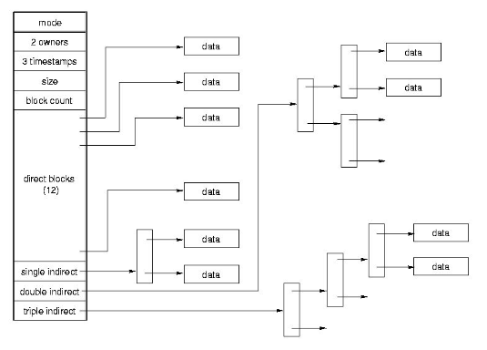
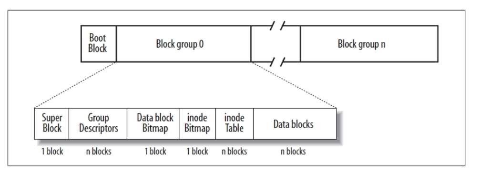
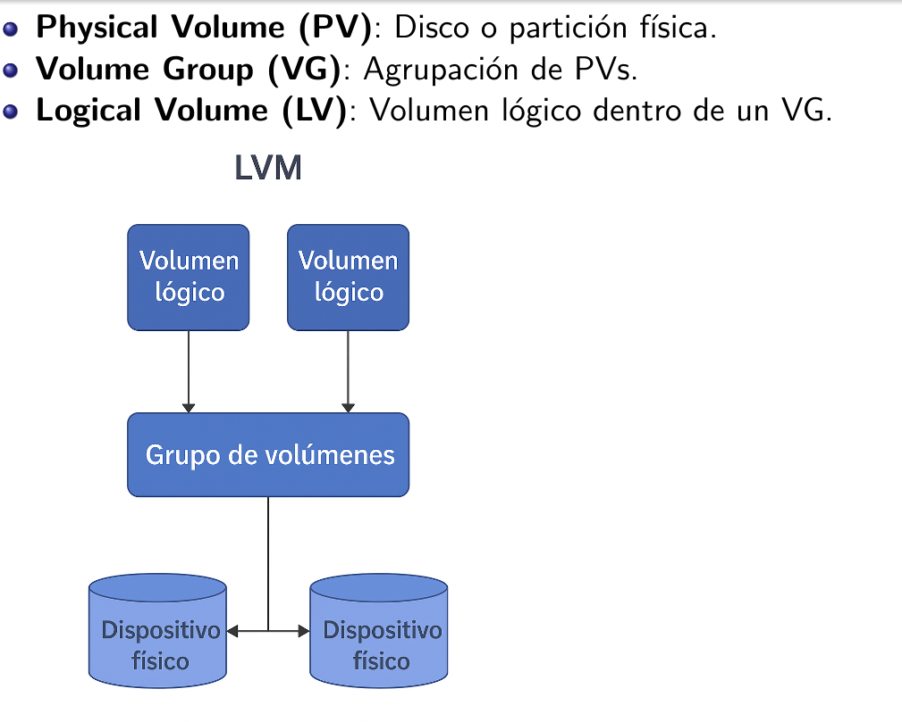
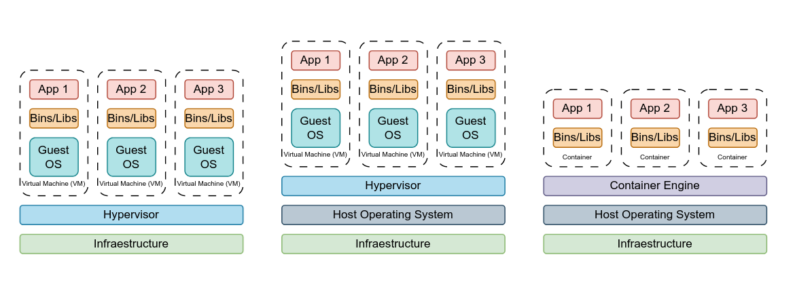

# Resumen

## Procesos

**Programa:** Conjunto de instrucciones diseñadas para realizar una tarea, almacenadas en la memoria.

**Proceso:** Instancia de un programa que está en ejecución, incluyendo su estado y recursos asignados.

En Linux se puede enviar señales desde un proceso no root a uno root, ya que divide los privilegios tradicionalmente asociados con root en distintas unidades llamadas *capabilities*, que pueden ser habilitadas o deshabilitadas.

**Capabilities:** Los procesos pueden ser privilegiados o no privilegiados. Las capabilities son las unidades resultantes de la división de privilegios tradicionalmente con root, que pueden ser habilitadas o deshabilitadas.

**Subreaper:** Procesos que se pueden autodeclarar como padres de procesos huérfanos que sean descendientes suyos.

**POSIX:** Estándar de mecanismos de interacción con el sistema operativo.

Si no se hace `wait()` del proceso hijo, cuando muere el hijo, el proceso queda en un estado zombie.

El SO hace copias _lazy_. Tanto el padre como el hijo tendrán las mismas páginas físicas hasta que alguna de ellas cambia el contenido, ahí se asigna una página física distinta para el proceso que modifica la memoria (*copy on write*) Sólo se comparten las páginas en modo lectura.

`execve()`: Sustituye la imagen de memoria del programa por la del programa ubicado en filename.

Cada letra luego del prefijo `exec`, nos indica un significado particular de loque hace cada función.

`strace`: Herramienta que nos permite generar una traza legible de las llamadas al sistema usadas por un programa dado.

Cuando el SO comienza, lanza un proceso que se suele llamar `init` o `systemd`.

`fork()` crea un proceso exactamente igual al actual. Retorna el pid del hijo para el padre y 0 en el hijo.

**Preemption:** Cuando se acaba el quantum, le toca el turno al siguiente proceso.

**PCB (Process Control Block):** Donde se encuenta el IP y otras cosas del proceso.

Las **syscalls** proveen una interfaz a los servicios brindados por el sistema operativo: **la API (Application Programming Interface)** del SO.

**Wrapper functions:** Permiten interactuar con el sistema con mayor portabilidad y sencillez. La biblioteca estándar de C incluye funciones que no son syscalls, pero las utilizan para funcionar (pej: `printf()` invoca a la syscall `write()`).

**Busy waiting**: El proceso no libera la CPU. Un único proceso de ejecución a la vez.

**Polling:** El proceso libera la CPU, pero todavía recibe un quantum que desperdicia hasta que la E/S esté terminada.

**Interrupciones:** El SO no le otorga más quanta al proceso hasta que su E/S esté lista y se comunica mediante una interrupción.

**Multiprogramación:** Capacidad de un SO de tener varios procesos en ejecución.

**Multiprocesamiento:** Tipo de procesamiento que sucede en los multiprocesadores.

Multiprogramación desde el código:
- **Bloquante:** Hago syscall, para cuando recibo el control, la E/S terminó. Mientras, me bloqueo.
- **No bloqueante:** Hago la syscall, que retorna en seguida. Puedo seguir haciendo otras cosas, pero debo enterarme de alguna forma si la E/S terminó.

carga del sistema = cantidad de procesos listos

tabla de procesos = lista de PCBs

**Señales:** mecanismo que incorporan los sistemas operativos POSIX que permiten notificar a un proceso la ocurrencia de un evento.

## IPC

**File Descriptor:** Índices de una tabla que indica los archivos abiertos por el proceso.

Los fd se heredan de un proceso padre a hijo al usar `fork()` y se mantienen en la llamada a `execve`

**Pipes:** Son un canal que se puede interpretar como un byte stream.

**Socket:** Interfaz de comunicación entre procesos que permite el intercambio de datos. Hay syscalls para manejarlos de manera homogénea independientemente del tipo.

**Sockets Unix:** Comunicación rápida y eficiente dentro de un sistema. Usan archivos en el sistema de archivos como puntos de conexión. No requuieren configuración de red.

**Sockets de red:** Usan direcciones IP y puertos. Permiten comunicación entre diferentes máquinas. Mayor latencia y overhead por protocolos de red.

Hay dos tipos de sockets:
- Stream Sockets
- Datagram Sockets

## Scheduling

Muchos procesos (técnicamente sus PCB's) se mantienen en memoria al mismo tiempo. Cuando se libera la CPU se debe elegir otro proceso de la cola de ready y darle CPU. O sea **CPU Scheduling**.

**Scheduler del SO:** Responsable de seleccionar un proceso de todos los que esten ready y darle CPU para que se procese.

**Ecuanimidad (Fairness):** Cada proceso reciba una dosis justa de CPU.

**Eficiencia:** tratar de que la CPU esté ocupada todo el tiempo.

**Carga del sistema:** minimizar la cantidad de procesos listos que están esperando CPU.

**Tiempo de respuesta:** minimizar el tiempo de respuesta percibido por los usuarios interactivos.

**Latencia:** minimizar el tiempo requerido para que un proceso empiece a dar resultados.

**Tiempo de ejecución:** minimizar el tiempo total que le toma a un proceso ejecutar completamente.

**Rendimiento (throughput):** maximizar el número de procesos terminados por unidad de tiempo. Para minimizarlo se podría ver de implementear SJF (Shortest Job First).

**Liberación de recursos:** hacer que terminen cuanto antes los procesos que tiene reservados más recursos.

**Programa intensivo en I/O:** Tiene muchas ráfagas de CPU cortitas. Esto sucede porque se la pasa esperando un input o generando un output, lo cual es algo que toma mucho tiempo (todo proceso que requiera comunicarse con el exterior consume mucho más tiempo en espera que uno que no).

**Programa intesivo en CPU:** Suele tener pocas ráfagas de CPU largas.

**Scheduler nonpreemptive o cooperativo:** Sin desalojo. Una vez el proceso obtiene la CPU se ejecuta hasta liberarla de forma voluntaria (puede haber terminado o pasar a un estado waiting).

**Scheduler preemptive o no cooperativo:** Con desalojo.  Se vale de la interrupción del clock para decidir si el proceso actual debe seguir ejecutándose o le toca a otro. El scheduler puede determinar cuando sacarle la CPU a un proceso.

### Criterios y objetivos de scheduler

- **Uso de CPU: (Maximizar)** Mantener la CPU tan ocupada como sea posible.

- **Throughput: (Maximizar)** Cantidad de procesos terminados por unidad de tiempo.

- **Turnaround: (Minimizar)** Cuánto le toma a un proceso terminar de ejecutar (tiempo esperando en ready + tiempo ejecutando en CPU + tiempo haciendo I/O). 

- **Waiting time: (Minimizar)** Suma de los períodos en ready.

- **Response time: (Minimizar)** Tiempo que pasa desde que el proceso es "lanzado" (se encuentra en _idle_ por primera vez) hasta la primera vez que esta running.

### Algoritmos de scheduling

- **First-Come, First-Served:**  
Se da el procesador al primer proceso que lo pide. Es _nonpreemptive_.

- **Roud-Robin:**  
Sigue la cola ready en orden de llegada de cada proceso, dandole la CPU a cada proceso por un quantum de tiempo.

- **Shortest-Job-First:**  
  Se asocia a cada proceso el largo de su proxima ráfaga de CPU y se elige para ejecutar el proceso que tenga la menor.  
  Si llega un proceso que tiene una ráfaga de CPU menor a lo que le falta al proceso ejecutando actualmente, depende de scheduler y puede hacer las siguentes cosas:

  - Tiene una versión _preemptive_ donde el scheduler desaloja al proceso en ejecución y le da la CPU al nuevo (**shortest-remaining-time-first**).
  
  - Tiene una versión _nonpreemptive_ donde el proceso en ejecución continúa hasta que termina su ráfaga de CPU.  

  Es lo más optimo respecto al waiting time, pero no podemos saber de antemano la longitud de la próxima ráfaga de CPU.

- **Multilevel Queue:**  
  - Se mantienen las colas separadas para cada prioridad.

  - Se ejecutan primero los procesos en la cola de mayor prioridad.

  - Cada cola tiene prioridad absoluta sobre las colas de menor prioridad.

  - La prioridad de cada proceso es estática, así que cada proceso vive en siempre la misma cola.

  - Se suele usar RR dentro de cada cola, aunque puede variar.

  - Se suele aplicar para particionar los procesos que requieren distinto response time.

- **Multilevel Feedback Queue:**
  - Se permite a los procesos cambiarse de cola.

  - Suele separar a los procesos según sus ráfagas de CPU: a mayor uso de CPU, más baja la prioridad.

  - Puede implementar _aging_ para evitar _starvation_ de los procesos con menor prioridad.

### Scheduling de Tiempo Real

- Sistemas **soft real-time**: No dan garantías sobre cuándo se va a poner a ejecutar un proceso RT. Solo que se van a ejecutar con más prioridad.

- Sistemas **hard real-time**: Tienen requerimientos más estrictos, una tarea crítica debe ser ejecutada dentro de un _deadline_.

El tiempo que pasa entre que ocurre un evento hasta que el proceso RT se ejecuta es llamado **event latency**.

- **Earliest Deadline First (EDF):**

  - Asigna prioridades dinámicamente según el deadline. Cuanto más pronto el deadline, más prioridad.

## Sincronización

**Concatenación y concurrencia:** Problemas fundamentales (que los problemas dependan entre sí y que se puedan correr varios procesos al mismo tiempo y no saber quien arranca).

**Programación distribuida:** Desarrollo de SW donde los componentes de una aplicación se ejecutan en múltiples computadoras independientes que se comunican entre sí a través de una red.

**Programación Paralela:** Divide un problema complejo en varias tareas más pequeñas y las ejecuta simultáneamente usando múltiples unidades de procesamiento.

**Race condition:** Cuando el resultado depende de la secuencia o el momento en que múltiples procesos o hilos acceden y manipulan un recurso compartido.

**Sección crítica:** Llamamos sección crítica a la parte del programa que accede a memoria compartida, y queremos que ejecute atómicamente.

- Solo hay un proceso a la vez en CRIT.
- Todo proceso que esté esperando entrar a CRIT va a entrar.
- Ningún proceso fuera de CRIT puede bloquear a otro.

**TestAndSet (TAS):** Establece atómicamente el valor de una variable entera en 1 (el lugar de memoria que utiliza lo determinás vos en un lugar de la memoria compartida). Es para saber si un proceso puede o no entrar a una sección crítica.

**Busy waiting:** Gastar CPU cuando no es necesario (Poner en un while una función de testandset()).

`sleep()`: Syscall que se utiliza para no hacer busy waiting (la solución más básica).

**Operación atómica:** No puede ser interrumpida por el procesador hasta que termine.

**Variable atómica:** Objeto que nos permite realizar operaciones de escritura y lectura de forma atómica. 

**Modelo Productor-Consumidor:** Ambos procesos (productor/consumidor, o sea, el proceso que esta ejecutando en CRIT y el que lo está esperando) comparten un buffer de tamaño limitado más algunos índices para saber dónde se colocó el último elemento. Esto tiene más problemas.

**Semáforos:** Se inventaron para resolver el anterior modelo. Es para mandar a dormir a algún proceso y poder despertar remotamente a los procesos que sean necesarios.

**Mutex (mutual exclusion):** Variable con dominio binario (puede tener 1 o 0 de valor).

**Deadlock:** Se traban los procesos entre sí esperando al otro.

**Condiciones de Coffman** - condiciones para la existencia de un deadlock:

- **Exclusión mutua:** Un recurso no puede estar asignado a más de un proceso.
- **Hold and wait:** Los procesos que ya tienen algún recurso pueden solicitar otro.
- **No preemption:** No hay mecanismo compulsivo para quitarle los
recursos a un proceso.
- **Espera circular:** Tiene que haber un ciclo de N $\geq$ 2 procesos, tal que Pi espera un recurso que tiene Pi+1.

## Administración de memoria

La memoria también se comparte, no solo para comunicar procesos, si no también para implementar la multiprogramación.

**Swapping:** Pasar a disco el espacio de memoria de los procesos que no se están ejecutando.

Problemas de memoria:
- Reubicación (cambio de contexto, swapping)
- Protección (memoria privada de los procesos)
- Manejo del espacio libre (evitando la fragmentación)

El **sistema operativo** es responsable de:
  - Saber qué partes de la memoria están en uso.
  - Saber qué proceso usa cada parte de la memoria.
  - Asignar y liberar espacios de memoria.

El **espacio de direcciones** (es una vista privada de la memoria) de cada proceso se conforma de **code, stack, heap y data**.

**Memoria stack:** 

  - Es administrada implícitamente por el compilador. 
  - Se reserva memoria para variables locales dentro de las funciones.
  - Se libera automáticamente al retornar.
  - Es de tamaño limitado y no puede usarse para estructuras dinámicas.

**Memoria Heap:**

  - El programador reserva y libera memoria manualmente.
  - `malloc()` para reservar.
  - `free()` para liberar.

**Fragmentación:** Tener memoria suficiente para atender una solicitud pero no es continua (puede ser interna de los bloques y/o externa), compactar es costoso. Soluciones pueden ser bitmap de la memoria en bloques de igual tamaño (no muy usada), lista enlazada es la otra.

**Lista enlazada:** Cada nodo representa a un proceso o bloque libre, donde figuran el tamaño del bloque y sus límites.

**Splitting:** Si un requerimiento de memoria es menor que una porción de memoria libre, se retorna la primera parte y se mantiene el resto en la free list.

**Coalescing:** Cuando la memoria es liberada, se verifica si las porciones aledañas también están libres, y en ese caso se mergean en una única porción más grande. (reduce la fragmentación externa).

**Dónde asignar?** First fit - Best fit - Quick fit - Todos fallan por ingenuidad, problemas con fragmentación interna y externa. Otros más complejos son listas segregadas para los tamaños más comunes, Slab allocator para pre-asignar memoria: usados en kernels. Buddy allocator: divide la memoria en potencias de 2, splitting y coalescing recursivo

Para correr programas que no requieren todo ya y todo el tiempo se podría combinar swapping con virtualización del espacio de direcciones -> **memoria virtual**. Se usa la unidad **Memory Management Unit (MMU)**.

**Memory Managment Unit (MMU):** Se ocupa de la traducción de direcciones virtuales a físicas. Sus objetivos son:

  - **Facilitar el uso de la memoria:** los programadores no tienen que gestionar manualmente la ubicación de código y datos.
  - **Transparencia**: los programas no saben que su memoria es virtual.
  - **Eficiencia**: traducción rápida con poco overhead.
  - **Protección**: los procesos no pueden dañarse entre sí.

Hay distintas maneras para el manejo de las traducciones de memoria virtual a fisica:
  - **Base y límite**: La CPU tiene un único set de registros base y límite. Durante un contexto switch, el SO debe cargar los valores del nuevo proceso.
  - **Segmentación**: Cada espacio de direcciones se separa en segmentos lógicos de distinto tamaño.
  - **Paginación**: La memoria virtual se divide en tamaño fijo (4kb comunmente). La memoria física se divide en marcos de páginas del mismo tamaño. Como cada página se mapea de manera independiente no es necesario que sea contigua la memoria asignada. Evita la fragmentación externa.

La memo virtual esta dividida en bloques de tamaño fijo llamados **páginas** y el de memoria física en bloques del mismo tamaño llamados **marcos/page frames**.

**Paginación a demanda:** en lugar de cargar el programa entero en memoria física para poder ejecutarlo, cargar **sólo las páginas que son necesarias en cada momento**.

Se agregó una cache llamada **Translation Lookaside Buffer (TLB)**, mapea directamente páginas a frames, cuando una entrada no está busca en la tabla como siempre, pero además se ubica en el cache, apuntando a que futuros accesos sean más rápidos.

Para la **elección de que páginas dejar** en memoria hay varios algoritmos:

- FIFO
- Second Chance
- Not recently used: Prioridades para desalojar una página: Las que no fueron ni referenciadas ni modificadas son las más convenientes.
- Last recently used: Asocia a cada página el tiempo de la última vez que se usó. Cuando se tiene que reemplazar una página, se elige la que hace más tiempo que no se usa. 

El mejor algoritmo de reemplazo es el que tenga el menor page fault rate

Qué sucede en un page fault? ...

**Dirty bit:** Se usa para indicar que una página fue modificada y que hay que bajarla a disco.

**Thrashing:** Lo que hace un proceso que pasa más tiempo cargando y descargando páginas que ejecutando. Para mitigar algunos SO corren un proceso **Out-Of-Memory killer** (ver)

**Localidad:** Conjunto de páginas que se usan activamente al mismo tiempo. Esta es clave para el diseño inteligente de reemplazos de páginas. 

**Localidad temporal:** las páginas más recientemente usadas tienden a ser reusadas en el corto plazo.

**Localidad espacial:** las direcciones cercanas entre sí suelen accederse juntas.

Para el problema de protección cada proceso tiene su propia tabla de páginas. No hay forma de acceder a una página de otro, (una manera de hacer esto es que cada proceso tenga su propio espacio de memoria (segmento)). La alternativa más común es combinar segmentación con paginado.

Para los `fork()` de los procesos se hace copy-on-write para las shared pages.

## Administración de E/S

Un dispositivo E/S va a tener conceptualmente, dos partes:
- Un dispositivo físico
- Un controlador del dispositivo: Interactúa con el SO mediante algún tipo de bus o registro.

**Drivers:** Módulos de software que pueden ser añadidos al SO para manejar dispositivos E/S. Conocen las particularidades del HW contra el que hablan, corren en máximo privilegio y de ellos depende el rendimiento de E/S.

**Controllers:** Componente mecánico y/o electrónico que trabaja como una interfaz entre un dispositivo y el driver.

**E/S síncrona:** La ejecución de la CPU que solicita la E/S, espera por su culminación (de la E/S).

**E/S asíncrona:** Cada E/S procede concurrentemente con la ejecución del CPU que la solicita.

Las 2 técnicas que le permiten al CPU **atender eventos** que suceden en cualquier momento y no están relacionados a los procesos de ejecución son:

- **Polling:** El driver periódicamente verifica si el dispositivo se comunicó.
  - Ventajas: sencillo, cambios de contexto controlados.
  - Desventajas: Consume CPU.

- **Interrupciones (o push):** El dispositivo avisa (genera una interrupción).
  - Ventajas: eventos asincrónicos poco frecuentes.
  - Desventajas: cambios de contexto impredecibles.

- **DMA (acceso directo a memoria):** Para transferir grandes volúmenes (la CPU no interviene). Requiere de un componente de HW, el controlador de DMA. Cuando el controlador de DMA finaliza, interrumpe a la CPU.

**Handler:** También conocidos como rutinas de servicios de interrupciones (**ISR**) son **callback functions** que se alojan en el driver que se encargan de manejar la interrupción.

**Software para E/S:** En el nivel **usuario**, se tienen bibliotecas (por ejemplo **stdio** en C), luego se tienen los módulos de nivel **kernel** los cuales serían los drivers y para el nivel **hardware** se tiene el firmware (el **firmware** es un programa informático de bajo nivel que controla los circuitos electrónicos de un dispositivo de hardware
).

Varios procesos pueden querer **ejecutar el driver a la vez**, por esto se generan horribles race conditions.

Tenemos **primitivas de sincronización** (las cuales se encargan de la sincronización de recursos compartidos por distintos procesos o threads). Estas y las **estructuras de datos** que pueda llegar a necesitar se inicializan al cargar el driver en el kernel.

Un driver no se linkea contra bibliotecas, asi que solo se pueden usar funciones que sean parte del kernel, por lo que las primitivas y estructuras de datos se deben inicializar al cargar el driver en el kernel.

**Módulo:** Piezas de código que pueden ser cargados/descargados en el kernel en tiempo de ejecución para extender la funcionalidad  sin necesidad de reiniciar el sistema.

Subsistema de E/S se ocupa de proveerle al programador una API sencilla (`open() close() read() write() seek()`) en cojunto a los drivers, el manejador de E/S se encarga de eso.

Los dispositivos se dividen en **char device y block device** (teclado y flash memory pej).

El diálogo con estos dispositivos tiene las siguientes características:

- Son de lectura, escritura o lecto-escritura.
- Brindan acceso secuencial o aleatorio (sería mejor decir
arbitrario).
- Son compartidos o dedicados.
- Permiten una comunicación de a caracteres o de a bloques.
- La comunicación con ellos es sincrónica o asincrónica.
- Tienen distinta velocidad de respuesta.

Una de las funciones del SO, en tanto **API** de programación, es brindar un acceso consistente a toda la fauna de dispositivos ocultando las particularidades de cada uno de ellos tanto como sea posible. (todo es un archivo)

La **planificación de disco** se trata de cómo manejar la cola de pedidos de E/S para lograr el mejor rendimiento posible. Además del ancho de banda y la latencia rotacional lo más importante es el **seek time**, que es el tiempo necesario para que la cabeza se ubique sobre el cilindro que tiene el sector buscado.

**Políticas de scheduling de E/S a disco:**
- FIFO/FCFS: Problema es que la cabeza va como bola sin manija.
- SSTF (Shotest Seek Time First): Puede generar starvation.
- Algoritmo de scan/elevator: Atiende los que le quedan para un lado y después los del otro.
- En la práctica ninguno se hace de manera pura, hay prioridades.

**Spooling** es una forma de manejar a los dispositivos que requieren acceso dedicado en sistemas multiprogramados. Se designa pej a otro proceso a que se encargue de ser dedicado ponele. Pej la impresora. Se entera el usuario que se hace spooling, no el kernel. **Simultaneous Peripheral Operation On-Line**. Mantiene una cola de archivos enviados. Se atienden uno a la vez.

Otros usos de E/S: locking -> ver bien

**Protección de información** tiene sentido?
- Cuanto vale para mi
- Que pasa si se pierde
- Que cosas no puedo hacer sin ella

En base a eso hay que asignarle un valor a la informacion y tomar una **politica de resguardo**

Estrategias de protección:
- Backup: Resguardar lo importante en otro lado - Copias totales, incrementales (copia desde la última incremental), diferenciales (copia desde la última total)  
Para restaurar diferenciales es última copia total + última diferencial, para incrementales necesito última total y todas las incrementales entre la última total y la fecha requerida.

A veces no alcanza solo una copia, un método común para implementar redundancia es **RAID (Redundant Array of Inexpensive Disks)** - se copia todo en los dos. Hay varios niveles de RAID.

**RAID 0 - stripping** No da redundancia, mejora rendimiento.

**RAID 1 - mirroing** Espejado de discos, mejora lecturas, escritura empeora el rendimiento, es caro.

**RAID 0 + 1** Combinacion de los anteriores, está espejado, al leer es un bloque de cada disco, se lee como en stripping pero al escribir se escribe cada bloque en ambos

**RAID 2** Todos los discos participan de todas las E/S, lo que lo hace más lento. Tiene 3 discos por cada 4 dedicados a error correction a nivel de bits con un Hamming code. Hace stripping a nivel de bit.

**RAID 3** Tiene por cada 3 de data 1 disco de parity a nivel de byte

**RAID 4** Como RAID 3 pero hace stripping a nivel de bloque.

**RAID 5** Cada bloque de cada archivo va a un disco distinto, para cada bloque un disco tiene los datos y otro tiene la información de paridad. Soporta la pérdida de un disco cualquiera

**RAID 6** Como RAID 5 pero con un segundo bloque de paridad distribuido entre todos los discos. Soporta rotura de hasta 2 discos.

RAID se combina con copias de seguridad.

## File systems

**BIOS/UEFI:** Inicializa hardware básico.

**Cargador de arranque:** Selecciona y carga el kernel (pej. GRUB).

**Kernel:** Inicializa el sistema operativo.

**Init/Systemd:** Arranca los servicios del sistema.

**Login:** Usuario puede iniciar sesión.

**Archivo:** Secuencia de bytes, sin estructura

**File system:** Módulo dentro del kernel encargado de organizar la información en disco. Algunos SO soportan algunos FS, y otros tienen soporte para algunos mediante módulos dinámicos de kernel.

Existen FS distribuidos, donde los datos están distribuidos en varias máquinas en la red (Pej NFS, DFS, SMBFS, AFS, CodaFS)

Las lecturas y escrituras a un medio de almacenamiento se hacen en unidades lógicas llamadas **bloques**. Estos son numerados a partir del 0 y tienen una dirección lógica/ LBA (Logical Block Address)

Responsabilidad del FS:
- Cómo se organizan de manera lógica, los archivos
  - Interna: Cómo se estructura la información dentro del archivo (secuencia de bytes).  
  - Externa: Cómo se ordenan los archivos (árbol).
- Cómo se representa un archivo
  - Cómo gestiono el espacio libre
  - Qué hago con los metadatos

El FS determina cómo se nombrará a los archivos:
- Caracteres de separación de directorio.
- Si tienen o no extensión.
- Restricciones a la longitud y caracteres permitidos
- Distinción o no entre mayúsculas y minúsculas.
- Prefijado o no por el equipo donde se encuentran.
- Punto de montaje.

Para un FS un archivo es una lista de bloques + metadata.

**FAT - File Allocation Table** usa una tabla que por cada bloque del archivo me dice en qué bloque está el siguiente elemento. Lo malo es que tengo que tener toda la tabla en memoria (inmanejable enn discos grandes), es poco robusto, si el sistema cae, la tabla estaba en memori y también pasa que no maneja seguridad.

**inodos** Cada archivo tiene un inodo, en las primeras entradas hay atributos y luego estan las direcciones de algunos bloques, después tenemos una entrada que apunta a un bloque **single indirect block**, luego otra entrada que apunta a un **double indirect block** y después hay un **triple indirect block**

El inodo del directorio root es distinguido: es siempre el inodo número 2 en Ext2.

**Ext2**

Pára encontrar un inodo específico del cual sé el nro (n):
- Primero hay que calcular en qué **block group** se encuentra (en el superbloque se sabe cuantos inodos hay por block group (cant_inodos)).
- En la inode table del block group se tienen m bloques de tamaño BLOCK_SIZE, donde en cada bloque habrá un conjunto de inodos (n mod cant_inodos = índice del inodo en la tabla (i)).
- cant_inodos / m = inodos_por_bloque
- i / inodos_por_bloque = bloque_del_inodo
- Del bloque_del_inodo busco el offset (i mod inodos_por_bloque).

**Link:** Alias para un archivo (La estructura externa pasa de un árbol a un grafo dirigido) tipos:

- **Hard links:** Crean otro nombre para el mismo inodo, sin duplicar datos. Se piede hacer en inodos porque no contienen el nombre del archivo ligado. Se tiene registro de cuantas referencias tiene cada inodo. No pueden hacerse en directorios o entre distintos sistemas de archivos.

- **Symbolic links:** Crean un archivo separado (con su inodo) que almacena el path al archivo original (ln -s). Permiten referenciar directorios en otros sistemas de archivos. No hay registro entre archivos de qué le pasa al otro.

**Implementación de árbol de directorios:** Un inodo es la entrada al root directory, por cada archivo o directorio dentro del directorio hay una entrada.

**Manejo del espacio libre:** Una manera de mejorar el rendimiento del manejo es con la introducción de un cache (copia en memoria de bloques del disco) (similar a las páginas - de hecho se usa un cache unificado para ambas para no tener duplicados). 

Para mantener consistencia, se graban los datos del cache. El sistema se podría interrumpir en cualquier momento igual, la alternativa más tradicional es proveer un programa que restaura la consistencia del FS (En UNIX es fsck) (recorre todo el disco y por cada bloque cuenta cuántos inodos le apuntan y cuántas veces aparece referenciado en la lista de bloques libres. Dependiendo de los valores de esos contadores se toman acciones correctivas, cuando se puede.)  
Para evitar que se tome mucho tiempo corriendo fsck, se pueden hacer **soft updates** (se rastran las dependencias en los cambios de la metadata para grabar sólo cuando hace falta).

Otra es **Journaling**, se lleva un registro de los cambios que habría que hacer, esto se graba en un buffer circular, cuando se baja el cache a disco, se actualiza una marca indicando qué cambios ya se reflejaron. Si el buffer se llena, se baja la cache a disco.

Otras características que puede incluir un FS avanzado:
- Cuotas de disco
- Encripción
- Snapshots
- Manejo de RAID por SW
- Compresión

Performance dependa de:

- Tecnología de disco.
- Política de scheduling de E/S.
- Tamaños de bloque.
- Caches del SO.
- Caches de las controladoras.
- Manejo general de locking en el kernel.
- FS

**NFS (Network FS):** Protocolo que permite acceder a FS remotos como si fueran locales, usando RPC. Para soportar esto, los SO usan una capa llamada _Virtual File System_. Esta capa tiene vnodes por cada archivo abierto, se corresponden con inodos, si el archivo es local, y si es remoto se almacena otra información.

**LVM** es un sistema de administración de volúmenes lógicos que proporciona mayor flexibilidad en la gestión del almacenamiento. (redimensionar particiones fácilmente; crear snapshots; mejor uso del espacio en disco; se puede realizar las operaciones en caliente, sin necesidad de downtime)

Para abrir un archivo la entrada de directorio provee la infromación necesaria para encontrar los bloques de disco donde está almacenado el archivo (en FAT el nro del primer bloque y en inodos el nro de inodo).

## Seguridad

La seguridad de la información se entiende como la preservación de las siguientes características:
- Confidencialidad
- Integridad
- Disponibilidad

Los sistemas de seguridad suelen tener:
- Sujetos
- Objetos
- Acciones

La idea es decir qué sujetos pueden realizar qué acciones sobre qué objetos. 

Los procesos son sujeto y objeto.

La abtracción mas común es la de usuario (sujeto del SO, que puede ejecutar acciones y a veces es dueño de archivos, procesos, memoria, puertos, etc)

Se pueden agrupar en colecciones de usuarios que son sujetos del sistema de permisos.

Otra abstracción son los roles (pej admin etc)

AAA:
- Authentication: Sos quién decís ser
- Authorization: Qué podés hacer
- Accounting: Dejo registrado qué hiciste

Matriz de control de accesos (sujetos x objetos) con entradas de permisos en cada celda. - **Discretionary Access Control - DAC**

**MAC (Mandatory Access Control):** Para manejar información altamente sensible, cada sujeto tiene un grado. Los objetos creados heredan el grado del último sujeto que los modificó.

d rwx r-x r-x -> En UNIX (owner/group/user)

Ataques por errores de implementación:

- **Control de parámetros:** Los parámetros se corren con código maligno y privilegios. Se debe sanitizar la entrada.

- **Race condition:** Comportamiento anómalo debido a una dependencia crítica inesperada en el timing de los eventos. 

- **Malware:** Diseñado para llevar a cabo acciones no deseadas y sin el consentimiento explícito del usuario (virus, troyanos, gusanos, bots, ...)

- **Format String:** Input no sanitizado, escalamiento de privilegios, pisada de pila o heap.

- **Enviroment Variables:** No se provee el path completo a la aplicación que se quiere ejecutar, escalamiento de privilegios, cambio de path.

- **Buffer overflow:** Se ingresa input de usuario directamente sobre un buffer de tamaño limitado, permitiendo que haya overflow.

- **Integer overflow**: El entero es otro número al pasarse de su rango de representación.

- **Escalado de privilegio/Broken Access Control:** Si los permisos están mal puede abrir la puerta a ataques.

- **Denial of service:** Por ejemplo el uso de Fork bombs

**Bugs de seguridad** son aquellos que exponen más funcionalidad o distinta al usuario que la que el programa dice tener.

**Exploit:** Fragmento de código que utiliza la funcionalidad oculta del programa vulnerable.

**Confidencialidad:** Garantizar que la información esté disponible solo para personas autorizadas y protegerla de accesos no autorizados.

**Integridad:** Asegurar que los datos se mantengan precisos y sin alteraciones no autorizadas.

**Disponibilidad:** Mantener la información accesible y disponible para usuarios autorizados, evitando interrupciones no planificadas.

Algunos SO implementan uno o más mecanismos para protegerse:

- **DEP (Data Execution Prevention):** Ninguna región de memoria es escribible y ejecutable
- **ASLR (Address Space Layout Randomization):** Modifica de manera aleatoria la dirección base de regiones importantes de memoria entre las diferentes ejecuciones de un proceso (impide ataque con instrucciones hardcodeadas).
- **Stack Canaries** (también conocido como Stack Guards or Stack Cookies): A nivel compilador se coloca un valor en la pila luego de crear el stack frame, antes de retornar verifica si el valor está bien.

## Virtualización

Def: Es la posibilidad de que un conjunto de recursos físicos se vean como varias copias de recursos lógicos.

**Simulación:** En el sistema anfitrión se construye una variable de estado artificial que representa al sistema huésped. Se lee cada instrucción y se modifica el estado como si ésta ejecutase realmente. Puede ser muy lento.

**Emulación de HW:** El sistema emulado se ejecuta realmente en la CPU del anfitrión. Se emulan componentes de HW.

**Virtualización asistida por HW:**
- Nace para evitar los problemas de:  
  - Ring aliasing: Programas para modo kernel ejecutados en modo usuario.
  - Address-space compression: Que la máquina virtual no pise la memoria del propio emulador. Desde el punto de vista del anfitrión sos un único proceso.
  - Non-faulting access to privileged state: Algunas instrucciones privilegiadas generan un trap cuando se ejecultan sin permiso.
  - Interrupt virtualization: Hay que simularle las interrupciones la SO huésped.
  - Access to hidden state: Parte del estado del procesador no es consultable por SW.
  - Ring compression: No hay protección entre el kernel y programas de usuario.
  - Frequent access to privileged resources: Cuello de botella en recursos accedidos frecuentemente.

- Para solucionar esto en Intel se agregaron al procesador las extenciones VT-x (VMX root, VMX non-root). Se agrega la Virtual Machine Control Structure (en memoria) tiene los estados de ambos y campos de control para ver qué interrupciónes, puertos de E/S recibe el huésped.

**Contenedores:** No son una virtualización completa. Cada imagen se construye en capas (base, dependencias, app, configuraciones). Los componentes fundamentales son:
- Namespaces: (Aislamiento) Proveen aislamiento entre procesos.
- Cgroups: Permiten limitar y contabilizar recursos.
- Layered FS: Modelo donde se apilan capas de solo lectura y una capa superior de escritura. Cada capa representa cambios respecto a la anterior.

Una imágen de Docker es una plantilla inmutable usada para crear contenedores. Contiene todo lo necesario para ejecutar una aplicación (código, dependencias, herramientas, bibliotecas y configuración). Son capas que se apilan sobre una capa base común.

**OCI (Open Cantainer Initiative):** Estándar abierto para contenedores. Define dos especificaciones principales:
- OCI Image Spec
- OCI Runtime Spec

Orquestación de aplicaciones contenerizadas:
- Kubernetes: Plataforma de código abierto para automatizar la implementación, el escalado y la administración de alplicaciones en contenedores.
- Openshift (y OKD): Usa Kubernetes de base, agrega restricciones de seguridad por defecto, interfaz web más completa, manejo de roles, facilidades para el desarrollador.

Cloud ver

Trusted Excecution Enviroment: Área protegida dentro de un CPU, ejecuta código y protege datos confidenciales.

Un motor de contenedores es un Software que se encarga de:
- Creación de imágenes de contenedor.
- Ejecutar contenedores.
- Administrar contenedores.

Un orquestador de contenedores es un software que automatiza la ejecución, la administración, el escalado y la interconexión de contenedores. Ayuda a manejar la complejidad de gestionar muchos contenedores a escala, algo que sería difícil de hacer manualmente.
