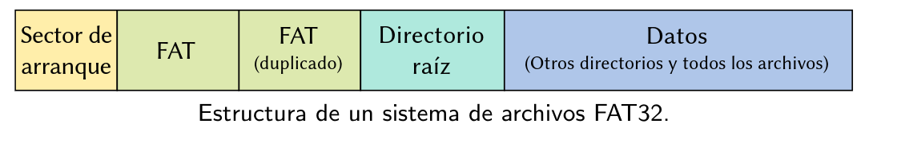
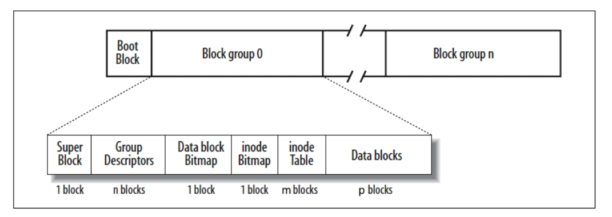

# Clase 7

El **sistema de archivos** es la parte del SO que nos permite administrar y ordenar los archivos dentro de un medio de almacenamiento.

Las lecturas y escrituras a un medio de almacenamiento se hacen en unidades lógicas llamadas **bloques**. Estos son numerados a partir del 0 y tienen una dirección lógica/ LBA (Logical Block Address)

El inodo del directorio root es distinguido: es
siempre el inodo número 2 en Ext2.

Links:

- **Hard links:** Crean otro nombre para el mismo inodo, sin duplicar datos. Se piede hacer en inodos porque no contienen el nombre del archivo ligado. Se tiene registro de cuantas referencias tiene cada inodo. No pueden hacerse en directorios o entre distintos sistemas de archivos.

- **Symbolic links:** Crean un archivo separado (con su inodo) que almacena el path al archivo original (ln -s). Permiten referenciar directorios en otros sistemas de archivos. No hay registro entre archivos de qué le pasa al otro.

**Ext2**

Pára encontrar un inodo específico del cual sé el nro (n):
- Primero hay que calcular en qué **block group** se encuentra (en el superbloque se sabe cuantos inodos hay por block group (cant_inodos)).
- En la inode table del block group se tienen m bloques de tamaño BLOCK_SIZE, donde en cada bloque habrá un conjunto de inodos (n mod cant_inodos = índice del inodo en la tabla (i)).
- cant_inodos / m = inodos_por_bloque
- i / inodos_por_bloque = bloque_del_inodo
- Del bloque_del_inodo busco el offset (i mod inodos_por_bloque).

## Funciones útiles
