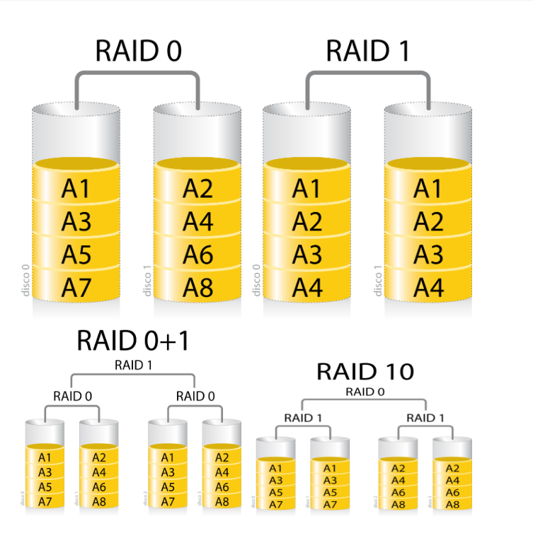
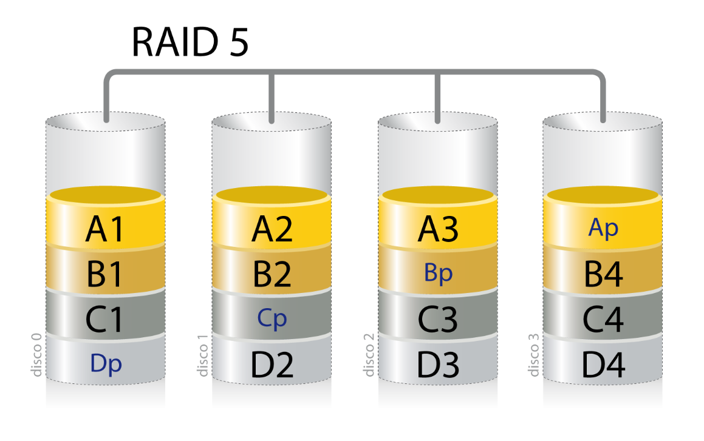

# E/S

Un dispositivo E/S va a tener conceptualmente, dos partes:
- Un dispositivo físico
- Un controlador del dispositivo: Interactúa con el SO mediante algún tipo de bus o registro.

Los **drivers** son componentes de SW muy específicos que conocen las particularidades del HW contra el que hablan, corren en máximo privilegio y de ellos depende el rendimiento de E/S.

Interacción con los dispositivos:

- Polling: El driver periódicamente verifica si el dispositivo se comunicó.
  - Ventajas: sencillo, cambios de contexto controlados.
  - Desventajas: Consume CPU.

- Interrupciones (o push): El dispositivo avisa (genera una interrupción).
  - Ventajas: eventos asincrónicos poco frecuentes.
  - Desventajas: cambios de contexto impredecibles.

- DMA (acceso directo a memoria): Para transferir grandes volúmenes (la CPU no interviene). Requiere de un componente de HW, el controlador de DMA. Cuando el controlador de DMA finaliza, interrumpe a la CPU.

Subsistema de E/S se ocupa de proveerle al programador una API sencilla (`open() close() read() write() seek()`) en cojunto a los drivers, el manejador de E/S se encarga de eso.

Los dispositivos se dividen en **char device y block device**(teclado y flash memory pej).

El diálogo con estos dispositivos tiene las siguientes
características:

- Son de lectura, escritura o lecto-escritura.
- Brindan acceso secuencial o aleatorio (sería mejor decir
arbitrario).
- Son compartidos o dedicados.
- Permiten una comunicación de a caracteres o de a bloques.
- La comunicación con ellos es sincrónica o asincrónica.
- Tienen distinta velocidad de respuesta.

Una de las funciones del SO, en tanto **API** de programación,
es brindar un acceso consistente a toda la fauna de dispositivos ocultando las particularidades de cada uno de ellos tanto como sea posible. (todo es un archivo)

La **planificación de disco** se trata de cómo manejar la cola de pedidos de E/S para lograr el mejor rendimiento posible.  
Ademas del ancho de banda y la latencia rotacional lo más importante es el **seek time**, que es el tiempo necesario para que la cabeza se ubique sobre el cilindro que tiene el sector buscado.

**Políticas de scheduling de E/S a disco:**
- FIFO/FCFS -> Problema es que la cabeza va como bola sin manija.
- SSTF (Shotest Seek Time First)-> Puede generar starvation.
- Algoritmo de scan/elevator (Atiende los que le quedan para un lado y después los del otro)
- En la práctica ninguno se hace de manera pura, hay prioridades.

**Spooling** es una forma de manejar a los dispositivos que requieren acceso dedicado en sistemas multiprogramados. Se designa pej a otro proceso a que se encargue de ser dedicado ponele. Pej la impresora. Se entera el usuario que se hace spooling, no el kernel. **Simultaneous Peripheral Operation On-Line**. Mantiene una cola de archivos enviados. Se atienden uno a la vez.

Otros usos de E/S: locking -> ver bien

**Protección de información** tiene sentido?
- Cuanto vale para mi
- Que pasa si se pierde
- Que cosas no puedo hacer sin ella

En base a eso hay que asignarle un valor a la informacion y tomar una **politica de resguardo**

Estrategias de protección:
- Backup: Resguardar lo importante en otro lado - Copias totales, incrementales (copia desde la última incremental), diferenciales (copia desde la última total)  
Para restaurar diferenciales es última copia total + última diferencial, para incrementales necesito última total y todas las incrementales entre la última total y la fecha requerida.

A veces no alcanza solo una copia, un método común para implementar redunjdancia es **RAID (Redundant Array of Inexpensive Disks)** - se copia todo en los dos. Hay varios niveles de RAID.

**RAID 0 - stripping** No da redundancia, mejora rendimiento.

**RAID 1 - mirroing** Espejado de discos, mejora lecturas, escritura empeora el rendimiento, es caro.

**RAID 0 + 1** Combinacion de los anteriores, está espejado, al leer es un bloque de cada disco, se lee como en stripping pero al escribir se escribe cada bloque en ambos

RAID 2 Todos los discos participan de todas las E/S, lo que lo hace más lento. Tiene 3 discos por cada 4 dedicados a error correction a nivel de bits con un Hamming code.

RAID 3 tiene por cada 3 de data 1 disco de parity a nivel de byte

RAID 4 como RAID 3 pero hace stripping a nivel de bloque.

RAID 5 Cada bloque de cada archivo va a un disco distinto, para cada bloque un disco tiene los datos y otro tiene la información de paridad. Soporta la pérdida de un disco cualquiera

RAID 6 Como RAID 5 pero con un segundo bloque de paridad distribuido entre todos los discos. Soporta rotura de hasta 2 discos.

RAID se combina con copias de seguridad.
