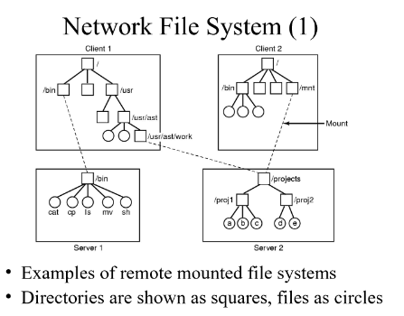

# File systems

BIOS/UEFI: Inicializa hardware básico.

Cargador de arranque (ej. GRUB): Selecciona y carga el kernel.

Kernel: Inicializa el sistema operativo.

Init/Systemd: Arranca los servicios del sistema.

Login: Usuario puede iniciar sesión.

**Archivo:** Secuencia de bytes, sin estructura

**File system:** Módulo dentro del kernel encargado de organizar la información en disco. Algunos SO soportan algunos FS, y otros tienen soporte para algunos mediante módulos dinámicos de kernel.

Existen FS distribuidos, donde los datos están distribuidos en varias máquinas en la red (Pej NFS, DFS, SMBFS, AFS, CodaFS)

Responsabilidad del FS:
- Cómo se organizan de manera lógica, los archivos
  - Interna: Cómo se estructura la información dentro del archivo (secuencia de bytes).  
  - Externa: Cómo se ordenan los archivos (árbol).
- Cómo se representa un archivo
  - Cómo gestiono el espacio libre
  - Qué hago con los metadatos

**Link:** Alias para un archivo (La estructura externa pasa de un árbol a un grafo dirigido)

El FS determina cómo se nombrará a los archivos:
- Caracteres de separación de directorio.
- Si tienen o no extensión.
- Restricciones a la longitud y caracteres permitidos
- Distinción o no entre mayúsculas y minúsculas.
- Prefijado o no por el equipo donde se encuentran.
- Punto de montaje.

Para un FS un archivo es una lista de bloques + metadata.

**FAT - File Allocation Table** usa una tabla que por cada bloque del archivo me dice en qué bloque está el siguiente elemento. Lo malo es que tengo que tener toda la tabla en memoria (inmanejable enn discos grandes), es poco robusto, si el sistema cae, la tabla estaba en memori y también pasa que no maneja seguridad.

**inodos** Cada archivo tiene un inodo, en las primeras entradas hay atributos y luego estan las direcciones de algunos bloques, después tenemos una entrada que apunta a un bloque **single indirect block**, luego otra entrada que apunta a un **double indirect block** y después hay un **triple indirect block**

Implementación de árbol de directorios: Un inodo es la entrada al root directory, por cada archivo o directorio dentro del directorio hay una entrada.

**Manejo del espacio libre:** Una manera de mejorar el rendimiento del manejo es con la introducción de un cache (copia en memoria de bloques del disco) (similar a las páginas - de hecho se usa un cache unificado para ambas para no tener duplicados). 

Para mantener consistencia, se graban los datos del cache. El sistema se podría interrumpir en cualquier momento igual, la alternativa más tradicional es proveer un programa que restaura la consistencia del FS (En UNIX es fsck) (recorre todo el disco y por cada bloque cuenta cuántos inodos le apuntan y cuántas veces aparece referenciado en la lista de bloques libres. Dependiendo de los valores de esos contadores se toman acciones correctivas,
cuando se puede.)  
Para evitar que se tome mucho tiempo corriendo fsck, se pueden hacer **soft updates** (se rastran las dependencias en los cambios de la metadata para grabar sólo cuando hace falta).

Otra es **Journaling**, se lleva un registro de los cambios que habría que hacer, esto se graba en un buffer circular, cuando se baja el cache a disco, se actualiza una marca indicando qué cambios ya se reflejaron. Si el buffer se llena, se baja la cache a disco.

Otras características que puede incluir un FS avanzado:
- Cuotas de disco
- Encripción
- Snapshots
- Manejo de RAID por SW
- Compresión

Performance dependa de:

- Tecnología de disco.
- Política de scheduling de E/S.
- Tamaños de bloque.
- Caches del SO.
- Caches de las controladoras.
- Manejo general de locking en el kernel.
- FS

**NFS (Network FS):** Protocolo que permite acceder a FS remotos como si fueran locales, usando RPC. Para soportar esto, los SO usan una capa llamada _Virtual File System_. Esta capa tiene vnodes por cada archivo abierto, se corresponden con inodos, si el archivo es locas, y si es remoto se almacena otra información.

**Estructura de FS de Ext2:** 

**LVM** es un sistema de administración de volúmenes lógicos que proporciona mayor flexibilidad en la gestión del almacenamiento. (redimensionar particiones fácilmente; crear snapshots; mejor uso del espacio en disco; se puede realizar las operaciones en caliente, sin necesidad de downtime)

Para abrir un archivo la entrada de directorio provee la infromación necesaria para encontrar los bloques de disco donde está almacenado el archivo (en FAT el nro del primer bloque y en inodos el nro de inodo).